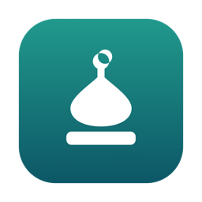
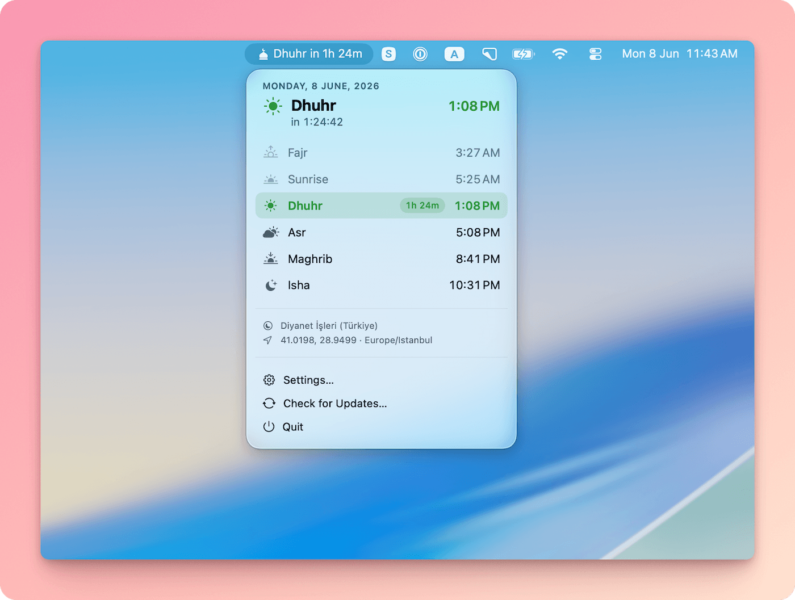
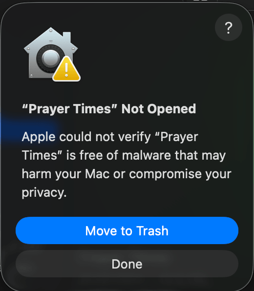
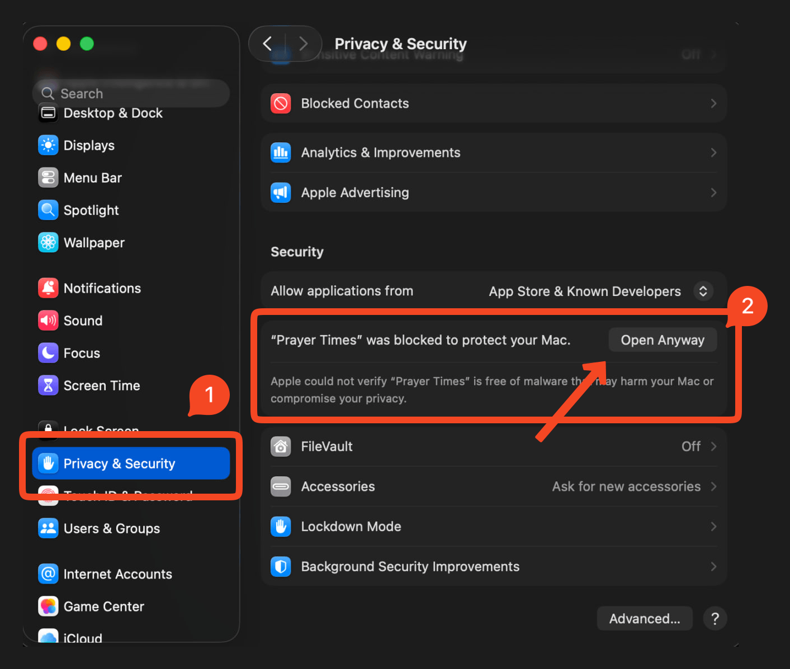

<div align="center">
  
  <h1>Prayer Times for macOS</h1>
  <p><strong>A free, native macOS menu bar app for Islamic prayer times</strong> — accurate Adhan (Azan) notifications, a live countdown to the next Salah, and 10 calculation methods.</p>

  <p>
    <a href="https://github.com/tareq1988/prayer-times-macos/releases/latest"></a>
    <a href="https://github.com/tareq1988/prayer-times-macos/releases"></a>
    
    
    <a href="LICENSE"></a>
  </p>

  
</div>

---

**Prayer Times** is a lightweight, open-source **macOS menu bar app** that keeps the
next **Islamic prayer time** (Salah / Namaz) and a live countdown right in your menu
bar, plays the full **Adhan (Azan)**, and fires per-prayer notifications. It is free,
private (no account, no tracking, no ads), and native SwiftUI — not an Electron
wrapper. It works worldwide with pluggable calculation methods including **Diyanet
(Turkey), Muslim World League, ISNA (North America), Umm al-Qura (Saudi Arabia),
Egyptian, Karachi (Pakistan), Moonsighting Committee, JAKIM (Malaysia), and Kemenag
(Indonesia)**.

## Install

**Homebrew** (recommended)
```sh
brew install --cask tareq1988/tap/prayer-times
```

**Direct download** — grab the latest `.zip` from
[Releases](https://github.com/tareq1988/prayer-times-macos/releases/latest), unzip,
and drag **Prayer Times.app** to your Applications folder.

> **First launch (unsigned build):** the current builds are ad-hoc signed (not yet
> notarized), so on first launch macOS shows _"Prayer Times" Not Opened_ and blocks it.
>
> To open it, go to **System Settings → Privacy & Security** and click **Open Anyway**,
> then **Open** in the confirmation dialog. (Or run
> `xattr -dr com.apple.quarantine "/Applications/Prayer Times.app"` in Terminal.)
>
> <p>
>   
>   &nbsp;
>   
> </p>

Requirements: **macOS 14 Sonoma or later** · Universal (Apple silicon + Intel).

## Features

- **Menu bar at a glance** — next prayer + live countdown, with 7 label styles (icon / name / countdown / clock combinations) and a mosque glyph.
- **Glanceable panel** — today's six times with the next highlighted, iqamah times, date, and the active method/location. Adopts **Liquid Glass** on macOS 26 (Tahoe), with a material fallback on Sonoma/Sequoia.
- **10 calculation methods** — Diyanet, JAKIM (Malaysia) and Kemenag (Indonesia) each validated to ±1 minute against official tables, plus Muslim World League, ISNA, Umm al-Qura, Egyptian, Karachi, Moonsighting, and fully Manual — with **Standard / Hanafi** Asr (madhab) and **high-latitude** rules.
- **Adhan & notifications** per prayer: prayer-entry, an early reminder (own lead time), and iqamah — each with its own sound. Plus a "send a sample" preview.
- **Full Adhan (Azan) playback** (Makkah / Madinah) via in-process audio, with a Stop control (works around the 30-second notification-sound limit).
- **Location aware** — manual coordinates or one-shot CoreLocation auto-detect, with country → method mapping.
- **Localized** — English, العربية (Arabic, RTL), Türkçe (Turkish), বাংলা (Bengali).
- **Launch at login** and **in-app auto-updates** (Sparkle), distributed via GitHub Releases + Homebrew.

## Why Prayer Times?

- **Free and open source** (MIT) — no subscription, no ads, no account, no analytics.
- **Native and tiny** — a real SwiftUI menu bar agent, not a browser in disguise; it sips memory and battery.
- **Accurate** — the calculation core is unit-tested against official published tables (the Diyanet method matches Turkey's Diyanet İşleri tables to within ±1 minute, every row).
- **Yours to verify** — the math lives in a standalone, UI-free Swift package anyone can read and test.

## FAQ

**Is it free?** Yes — completely free and open source under the MIT license.

**Which prayer time calculation methods are supported?** Diyanet (Turkey), Muslim
World League, ISNA (North America), Umm al-Qura (Saudi Arabia), Egyptian General
Authority, University of Islamic Sciences Karachi (Pakistan), Moonsighting Committee,
JAKIM (Malaysia), Kemenag (Indonesia), and a fully Manual method — with Standard or
Hanafi Asr and high-latitude rules. The Diyanet, JAKIM, and Kemenag methods are each
validated to ±1 minute against their official published tables.

**Does it play the Adhan / Azan?** Yes, the full Adhan (Makkah or Madinah) plays at
prayer time, with a Stop control. You can also enable lighter per-prayer
notification sounds.

**Does it work offline?** Yes. Times are computed locally from your coordinates —
no internet connection or external API is required.

**Does it track me?** No. There is no account, no telemetry, and no ads. Location is
used only on-device to compute times.

## Architecture

```
PrayerKit/            Pure, UI-free Swift package (the calculation core + models)
  Calculation/        Engine, solar math, method adapters (no UI/IO, unit tested)
  Models/             Prayer, PrayerTimes, AppSettings, …
PrayerTimes/          The SwiftUI app (MenuBarExtra agent)
  App/ Settings/ Services/ Resources/
project.yml           XcodeGen project (the .xcodeproj is generated, git-ignored)
```

The calculation core is pure and fully unit-tested — including a hard gate that
reproduces official Diyanet monthly tables to ±1 minute. Everything Islam-specific
lives in **adapters** that produce parameters; the engine is a generic
astronomical calculator. See [`CLAUDE.md`](CLAUDE.md) for the full layout.

## Build & run

```sh
brew install xcodegen        # one-time
./scripts/run.sh             # build + install into /Applications + relaunch (ad-hoc signed)
cd PrayerKit && swift test   # run the calculation-core tests
```

`scripts/run.sh` regenerates the Xcode project when sources change. Or open the generated
`PrayerTimes.xcodeproj` in Xcode and hit Run.

## Releasing

```sh
# bump MARKETING_VERSION in project.yml, commit, then:
./scripts/release-local.sh 0.2.0
```
Builds a universal app, EdDSA-signs it for Sparkle, updates the appcast, publishes
the GitHub Release, and bumps the Homebrew cask. For notarized builds (no Gatekeeper
prompt), see [`RELEASING.md`](RELEASING.md).

## License

[MIT](LICENSE) © Tareq Hasan

---

<sub>Keywords: macOS prayer times app · menu bar Adhan / Azan app for Mac · Islamic
Salah / Namaz times · Muslim prayer reminder · Diyanet namaz vakti · waktu solat
Malaysia (JAKIM) · jadwal sholat Indonesia (Kemenag) · free open-source prayer time
app for macOS · ISNA, Umm al-Qura, Muslim World League, Karachi & Egyptian
calculation methods.</sub>
